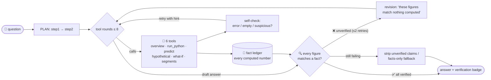
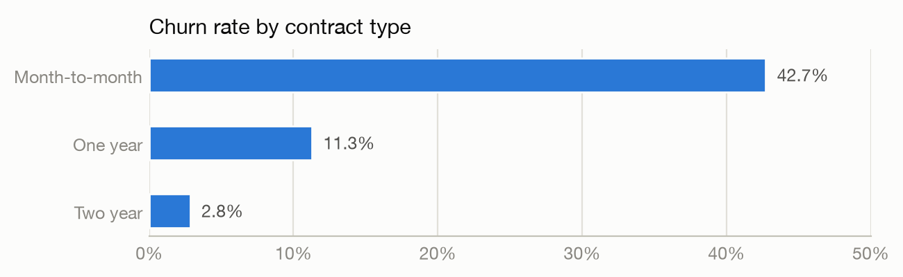
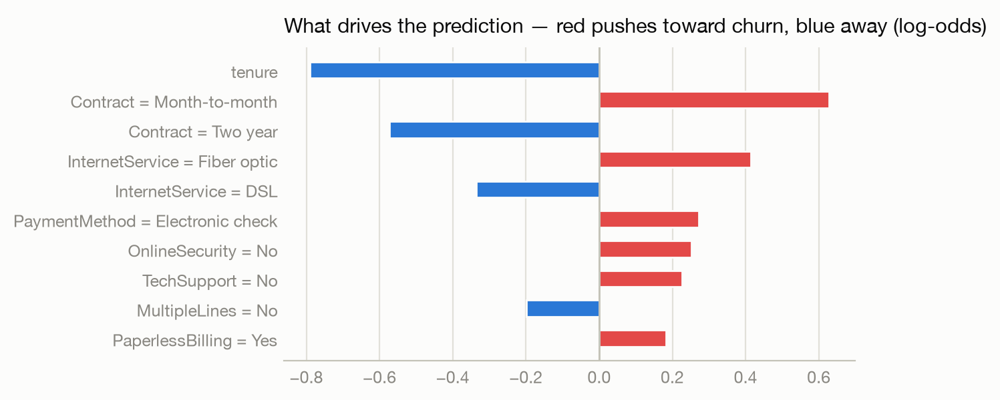
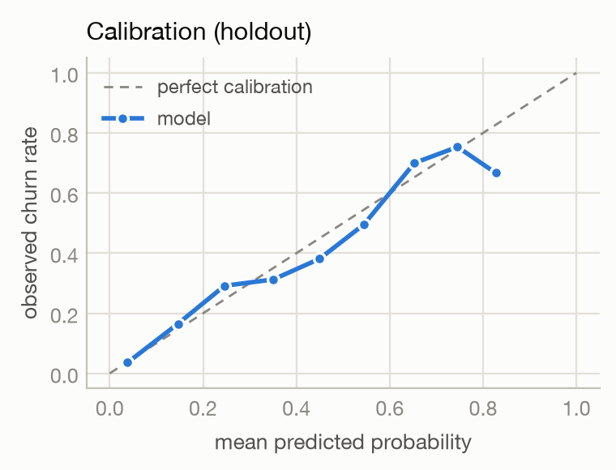

<div align="center">

# 📉 ChurnSight

### An autonomous data-analyst agent that **never invents a number**

*Ask it anything about 7,043 telecom customers data it plans, computes with real tools,<br>self-checks, and every figure in every answer is verified against an actually-computed result.*

[](https://ahmad9022032-autonomous-churn-analyst-appstreamlit-app-ktmenl.streamlit.app/)
[](https://churnsight-web.onrender.com/)


</div>

---

## 💬 See the reasoning unfold

```text
you › Which 5 customers are most likely to churn, and what is their average monthly charge?

PLAN  Retrieve top-5 customers by predicted churn risk → compute their average MonthlyCharges
  → run_python({"code": "top5 = df.nlargest(5, 'predicted_churn_risk')[...]"})
  ✅ ok
verify: 11/11 figures verified against computed results (all verified)
```

| Customer ID | Predicted churn risk | Monthly charge |
|:-----------:|:--------------------:|:--------------:|
| 5178-LMXOP  | 0.8653               | $95.10         |
| 9300-AGZNL  | 0.8633               | $94.00         |
| 9497-QCMMS  | 0.8630               | $93.55         |
| 7216-EWTRS  | 0.8619               | $100.80        |
| 2720-WGKHP  | 0.8594               | $94.00         |

**Average monthly charge of these five: $95.49** · *2 LLM calls · 2 tool steps · 9.4s · 11/11 figures verified*

And when you try to trick it:

```text
you › Does churn risk correlate with region?

PLAN  check data overview → respond about missing region column
  → get_data_overview({})   ✅ ok
answer: The dataset does not contain a "region" column, so churn risk cannot be
        correlated with region directly. Consider InternetService, Contract,
        or PaymentMethod instead.
```

No column? It says so. No computation? No number. That's the whole point.

---

## 🧭 What I built

| | Stage | Deliverable |
|--|-------|-------------|
| 🧠 | **Model as a callable tool** | Audited & cleaned dataset → logistic-regression churn model with **per-customer explanations** → `predict_churn_risk(customer_id) → {risk_score, risk_percentile, top_factors}` · committed artifact, notebook, [PDF report](notebooks/churn_model_documentation.pdf) |
| 🤖 | **The agent** | Hand-rolled **plan → act → check** loop · 6 tools · restricted-execution sandbox · deterministic self-checks · **numeric-provenance verifier** |
| 💻 | **Chat interface** | Streamlit chat wired **live** to the model + agent, streaming the plan / tool calls / verification verdict as they happen · CLI REPL twin |
| ⚛️ | **React frontend + API** *(optional stage, built & deployed)* | [`react-app/`](react-app/) → **[live on Render](https://churnsight-web.onrender.com/)** — FastAPI backend streaming agent events as NDJSON + React 19 app with routed pages (Chat · Dataset · Customer Risk · What-If Lab) and reusable components, driving the **same** agent through the same tools *(free tier — first visit after idle takes ~1 min to wake)* |



**Why no framework?** The loop's transparency — what gets retried, what gets verified, what gets *refused* is the deliverable. A framework would hide exactly the parts being assessed, and a hand-rolled loop keeps prompts small enough for free-tier rate limits (≈250-token system prompt, 12-LLM-calls-per-question hard cap, `Retry-After`-honoring backoff). Typical question: **2–3 LLM calls, 1.6–8s**.

---

## 🔎 The data issues I found and how I handled them

The brief deliberately doesn't say what's wrong with the file. The audit found **two real issues** and proved everything else clean:

| # | Finding | Decision & why |
|---|---------|----------------|
| 1 | **`TotalCharges` arrives as text** — 11 values are a single space. All 11 are `tenure = 0` customers, all non-churned: brand-new, **never-billed** accounts. | **Impute `0.0` and keep the rows.** Zero is the *semantically true* amount billed so far — a fact, not a guess. Keeping all 7,043 rows means every count the agent computes matches the source file in a system graded on numeric traceability, silently dropping rows is poison. |
| 2 | **`SeniorCitizen` encoded `0/1`** while every other binary column is `Yes/No`. | **Normalize to `Yes/No`.** Lossless; one consistent encoding for users, the agent's filters, and the model. |

> [!NOTE]
> **The null-result audit is evidence too.** Checked and found *clean*: no duplicate rows or IDs · no stray whitespace or casing beyond finding #1 · no negative/impossible values · service-flag structure exactly consistent (`"No internet service"` appears **iff** `InternetService == "No"`) · `TotalCharges ≈ tenure × MonthlyCharges` holds for every row (corr **0.9996**). The file is the pristine classic Telco dataset — and documenting what *isn't* wrong is part of understanding it. The cleaning code **asserts** the structure it fixes (exactly 11 blanks, all tenure-0, all non-churned), so a changed input fails loudly instead of mis-cleaning silently.

Two modeling exclusions, both deliberate: **`customerID`** (identifier — kept for lookups only) and **`TotalCharges`** (that 0.9996 collinearity destabilizes coefficients *and* would make what-if scenarios physically impossible — changing `tenure` while holding a stale total describes a customer that can't exist).



---

## 🎯 Why this metric

> [!IMPORTANT]
> **Accuracy was rejected first.** With 26.5% churn, predicting *"nobody churns"* scores **73.5%** while being completely useless. Any single 0.5-threshold metric inherits that blindness.

| Role | Metric | The reasoning |
|------|--------|---------------|
| **Primary** | **PR-AUC** (average precision) | The business question is *"how well are the churners — the minority we care about — ranked?"* PR-AUC gives zero credit for confidently ranking easy non-churners, unlike ROC-AUC under imbalance. |
| Secondary | ROC-AUC | The lingua franca for this dataset; comparison anchor. |
| Operational | Recall / precision / **lift @ top-decile** | A retention team has a **contact budget**, not a threshold: *"if we can call 10% of customers, how many churners are on that list?"* |
| Trust | **Brier + reliability curve** | The agent quotes probabilities to humans — **0.8 must mean ~80%**. This is also why there's **no `class_weight="balanced"`**: reweighting wrecks calibration, and the probability *is* the product. Imbalance is handled by stratification + minority-focused metrics instead. |

**Holdout results** (stratified 20%, seed 42 — the exact served artifact):

| PR-AUC | ROC-AUC | Precision@top-10% | Lift@top-10% | Brier |
|:------:|:-------:|:-----------------:|:------------:|:-----:|
| **0.6305** | **0.8395** | **0.736** | **2.77×** | 0.1389 |

Logistic regression **beat** HistGradientBoosting on CV PR-AUC (0.660 vs 0.649) while giving exact, dependency-free per-customer explanations (`coefficient × deviation-from-training-mean`, one-hot terms folded back to their parent column) — the interpretable model won without a trade-off. Full narrative: [`notebooks/churn_eda_and_model.ipynb`](notebooks/churn_eda_and_model.ipynb) · [PDF report](notebooks/churn_model_documentation.pdf).

<p>


</p>

---

## 🛡️ How the agent plans and how verification works

### Planning (multi-step, self-directed)

Every episode opens with a model-written plan (`PLAN: score customers → aggregate by segment → combine`) — induced by the system prompt rather than a separate LLM call, because on a throttled free tier an extra call per question is the wrong trade. The loop then runs up to 8 tool rounds across **six tools** — model paths are deterministic canned tools (graded behavior can't depend on a free-tier LLM writing correct pandas); free-form code is sandbox-only for EDA, where a failed attempt is cheap:

| Tool | What it does |
|------|--------------|
| `get_data_overview` | Schema, category counts, ranges, churn base rate, cleaning notes — kills nonexistent-column hallucinations |
| `run_python` | **Restricted pandas** on `df` which also carries `predicted_churn_risk` per customer, so *"call the model, then aggregate the data, then combine"* is one real computation |
| `predict_churn` | Risk score + percentile + top factors for an existing customer |
| `predict_hypothetical` | Any partial profile — unspecified fields defaulted **and disclosed** |
| `what_if` | Baseline vs projected risk under feature changes |
| `segment_risk` | Predicted risk *and* observed churn per segment |

The sandbox is defense-in-depth: an **AST whitelist gate** (no imports, loops, dunders, `getattr`, file writes), a **stripped namespace** (df copy + whitelisted `pd`/`np` + minimal builtins), and a **killable worker subprocess** with a 5s timeout — deliberately a framed-pickle subprocess rather than `multiprocessing` (whose spawn mode broke under stdin-launched parents) or `SIGALRM` (main-thread-only — dies quietly under Streamlit's thread).

### Self-checks (deterministic code, not vibes)

Every tool returns `{status, data, facts, hint}`. Errors bounce back with targeted hints; empty results get flagged (*"0 rows — check filter values against the overview"*); suspicious values (rates > 100, negative counts, NaN) get called out; a tool failing repeatedly escalates to *"try another approach or answer honestly with what you have."* Provider flakes are part of the design too: Groq occasionally 400s when the model flubs a native tool call — that's caught, retried, and after two strikes the loop **auto-switches to a structured-JSON fallback** (provider-enforced `response_format`), which was live-tested end-to-end.

### The verifier — *"never invent a number"*, enforced by code

Every tool result feeds machine-readable numeric **facts** into a per-question ledger — the verifier never parses numbers out of prose. When the model drafts an answer:

1. **Extract** every figure (`7,043` · `42.7%` · `$95.49`), skipping customer IDs, code spans, ordinals, "top N", and numbers from the user's own question.
2. **Match** each against the ledger — rounding-aware (`26.5%` verifies against a computed `0.26537`) under a transform cascade: identity, ×÷100, complement (*"57% stay"*), absolute value, and pairwise derivations (ratio / difference / share) of two facts.
3. **Reject** what doesn't match: the model gets ≤2 revisions showing exactly which figures failed and the full fact list — *recompute or remove*.
4. **Degrade honestly** if it still fails: offending sentences are stripped with a disclosure note; if most of the answer was unverifiable, it's rebuilt purely from ledger facts — a path that **cannot hallucinate by construction**.

Every answer carries its verdict in the UI: `✅ 11/11 figures verified against computed results`.

> [!WARNING]
> **Battle-tested, not just designed — three real catches from live testing, all in the git history:**
> 1. The model claimed *"month-to-month ≈ 38% of all customers"* (wrong — it's 55%), and "38" **verified anyway**: an unrelated ratio of two ledger facts (1473/3875 = 38.0%) collided with it. Fix: pairwise-derived matches now require **≥3 significant digits** — *precision earns trust*, vague figures must come from a single computed fact.
> 2. In JSON-fallback mode the model **fabricated a complete answer** (risk "0.42 / 0.18 / 0.07" — real values 0.4259 / 0.1124 / 0.0332) while claiming a tool had returned it. The empty ledger caught it; the fallback contract now demands tools-before-figures. Same question after the fix: real values, 3/3 verified.
> 3. Numbers inside list-of-records results weren't harvested into the ledger, and LLM-written customer IDs with unicode hyphens (`5178‑LMXOP`) dodged the ID filter — the verifier **correctly refused to ship** both times (failing safe), then both gaps were fixed with regression tests.

---

## ⚡ Quick start

```bash
git clone https://github.com/ahmad9022032/autonomous-churn-analyst.git
cd autonomous-churn-analyst
python3 -m venv .venv && source .venv/bin/activate
pip install -e ".[app,dev]"
cp .env.example .env        # add your free Groq key → console.groq.com

streamlit run streamlit-app/streamlit_app.py              # 💻 chat UI
python -m churn_agent.cli                                 # 🖥️ terminal REPL, live verify trace
python -m churn_agent.cli "average churn risk by contract"  # one-shot
python -m churn_agent.train                               # 🔁 reproduce the model artifact
pytest                                                    # ✅ 79 tests — all offline, no API key needed
```

**Docker:** `docker build -t churnsight . && docker run --rm -p 8501:8501 --env-file .env churnsight`
*(authored & reviewed; not built locally — Docker isn't installed on the dev machine, noted honestly)*

<details>
<summary><b>📁 Project structure</b></summary>

```
├── streamlit-app/              # 💻 the Streamlit chat app (pure renderer of agent events)
├── react-app/                  # ⚛️ the React app: FastAPI backend + React frontend
├── src/churn_agent/
│   ├── data.py                 # audit + cleaning with executable invariants
│   ├── model.py                # pipeline, explanations, hypothetical normalization
│   ├── train.py                # python -m churn_agent.train → artifact + metrics
│   ├── sandbox.py              # AST gate + stripped namespace + killable worker
│   ├── tools.py                # 6-tool registry, fact envelopes, fuzzy dispatch
│   ├── llm.py                  # Groq/OpenRouter client, backoff, JSON fallback, FakeLLM
│   ├── verify.py               # fact ledger, number extraction, transform matching
│   ├── agent.py                # the plan-act-check loop
│   └── cli.py                  # rich REPL
├── notebooks/                  # executed EDA+training notebook + PDF report
├── artifacts/                  # committed model.joblib + metrics.json
└── tests/                      # 79 tests incl. FakeLLM loop proofs & sandbox escapes
```
</details>

<details>
<summary><b>🧪 What the 79 tests prove</b></summary>

Sandbox escapes rejected (`import os`, `().__class__.__mro__`, `df.to_csv`, `getattr`, loops) and timeouts respawn the worker · planted hallucinated numbers trigger revision, then degradation with **nothing unverified shipped** · cleaning invariants · model bundle roundtrip · hypothetical defaults disclosed · JSON-fallback switch · multi-turn memory · honest no-answer on provider outage. The whole agent loop is proven **offline** with a scripted `FakeLLM` against the *real* tools and verifier — so the graded behaviors don't depend on (or spend) API quota.
</details>

<details>
<summary><b>☁️ Deploying (Streamlit Community Cloud)</b></summary>

Push to GitHub → share.streamlit.io → *New app* → main file `app/streamlit_app.py` → paste secrets:

```toml
LLM_API_KEY = "gsk_your_groq_key"
LLM_BASE_URL = "https://api.groq.com/openai/v1"
LLM_MODEL = "openai/gpt-oss-120b"
```
Provider is a 3-variable swap (any OpenAI-compatible endpoint, e.g. OpenRouter).
</details>

---

## 💭 Reflection

**Hardest part:** the numeric-provenance verifier. Extracting "numbers the model claims" from free text sounds trivial and isn't just percents vs fractions, rounding, complements, currency, customer IDs that look like numbers. The genuinely hard lesson was the live false-accept: with enough ledger facts, *some* pairwise derivation collides with almost any low-precision figure, so derived matches now have to earn trust with precision. Too loose is theater; too strict and every answer degrades — tuning that boundary was the most interesting engineering here.

**What I had to figure out:** Groq's lineup had rotated (the brief's Llama models are gone → model became an env var with hardened config errors) · `multiprocessing` spawn re-executes the parent's main module (→ framed-pickle subprocess sandbox) · Groq surfaces model-side tool-call flubs as 400s (→ routed into the JSON-fallback counter) · pandas 3.0 string-dtype changes (→ portable idioms so the notebook also runs on Colab's pandas 2.x).

**The extra time went into the optional React stage.** Once the required pieces were done and deployed, I used the remaining time to build the React + FastAPI app (`react-app/`) with Claude's help and deploy it on Render — which turned out to be a real test of the architecture: because the agent was a clean importable package with an event stream, the entire second interface needed zero changes to the core. Still on the wish list: a critic agent re-deriving each claimed figure independently (the ledger makes that cheap), and a formal eval set with a measured hallucination rate.

## ⏱️ Time log

Roughly ~10-12 focused hours for the required scope, AI-assisted end-to-end, plus extra time for the optional stage:

- **Studying & understanding the problem** — reading the brief, profiling the dataset, Some research about the problem — *~1h*
- **Planning** — architecture, tools & techniques, what to build in what order — *~1h*
- **Model training & evaluation** — data cleaning, notebook EDA, model comparison, metric justification — *~2h*
- **Building the agent** — sandbox, tools, provenance verifier, plan-act-check loop, offline tests, live testing against Groq — *~3.5h*
- **Building the Streamlit app** — chat UI wired to the agent, error handling, testing — *~0.5h*
- **GitHub, README & documentation** — incremental commits, README, PDF report — *~1h*
- **Deployment** — Streamlit Cloud, Dockerfile — *~0.5h*
- **Extra time** — built the React + FastAPI app with Claude and deployed it on Render and its setup + crafting and sharpening — *~2h*
